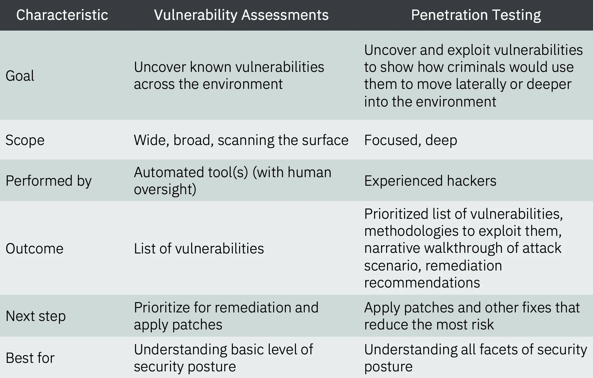

# we should follow military rules 
 read some rules 
 [1](../Book/MilitaryRule/25-Reasons-Military-Part-1.pdf) 
 [2](../Book/MilitaryRule/25-Reasons-Military-Part-2.pdf) 

# Hardening 
how strongly we can secure our system . For example linux /window os hardening . For those there have 100 plus way to secure . 
We can follow CIS benchmarks documentation to secure . 
 1. go to the [CIS site ](https://www.cisecurity.org/cis-benchmarks/)
 2. chose  ur system and download benchmark.

-  Linux [benchmarks](./CIS_Debian_Linux_11_Benchmark_v100_221021_192954.pdf)
- WIndows 10 [benchmarks](./CIS_Microsoft_Intune_for_Windows_10_Release_2004_Benchmark_v1.0.1.pdf)

# Process of Audit 

- download   system's benchmark 
- follow the doc to hardening 
- create   check list 
- note the finding vulnerability /wrong activities 
- generate   report and submit 

***an employee for audit rule , must have to gain  certificate of CISA course***

# Pentesting Summary 
- some mind map of pentest
    [1](https://www.mindmeister.com/1470766611/web-app-pentest?fullscreen=1)
    [2](https://pbs.twimg.com/media/FfIW3LaXoAEIsvu?format=jpg&name=4096x4096)
    [3](https://camo.githubusercontent.com/2092fb3a8ff107e3b6b2f2c5f17fcdcad20fd6bb348b0a60961139e3982585a4/68747470733a2f2f3562687576346e3335682e6769746875622e696f2f70656e746573746d696e646d61702f696e6465782e706e67)

- pentest report generate 

    1. metasploit [dummy report (own)](../self_notes/Sufia_metasploit-dummy_pentest_report.pdf) for 4 exploitation 
    2. report [sample](https://pentestreports.com/reports/)

- website pentest tool we used 
    1. nikto 
    2. zaproxy 
    3. wpscan (git repo for wordpress website scan)
    3. [pentest](https://pentest-tools.com/)

    test website : scanme.nmap.org , vulnweb.com , testphp.bulnweb.com

# Extension 
    wappalyzer - to find which technology(wordpress/framework) used for website.

 # Vulnerability  
    - vuln details check from [CVE](https://www.cvedetails.com/)
    - vulnerability scanning vs pentest 

   

 # vulnerability Management tool
    - Nessus (top 5 tool ) -> [download](https://www.tenable.com/downloads/nessus?loginAttempted=true) for windows also linux
    - OpenVas
    - Nikto
    - Qualys
    - Nmap

# Task

    - course on pentest from [coursera](https://www.coursera.org/learn/ibm-penetration-testing-incident-response-forensics)
    - Nessus download
