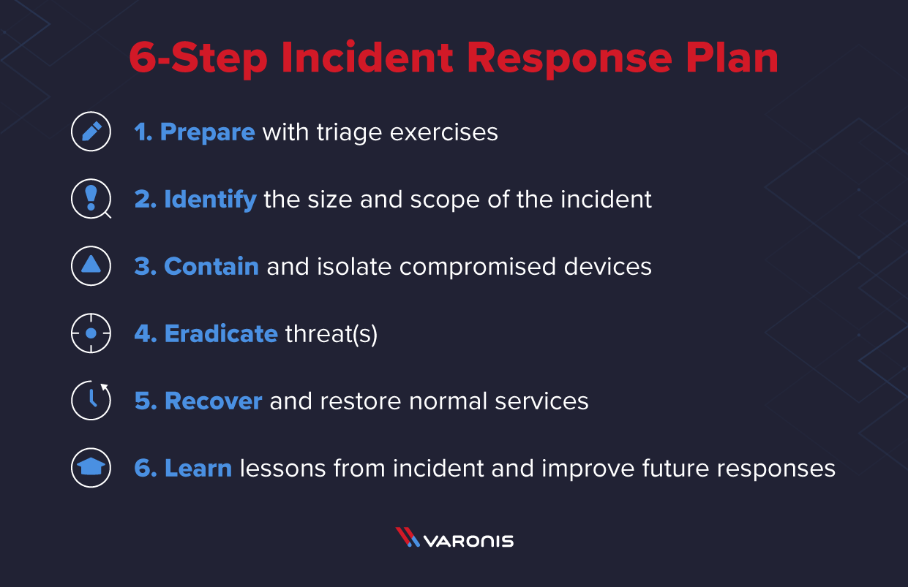

# SOC (security operation center)
A SOC is a team primarily composed of security analysts (also tools, process,playbook) organized to detect , analyze, respond to , report on , and prevent cybersecurity incidents.

must know these topic to become a SOC Analyst : 

**Resources**
- Soc fundamental from [LetsDefend](https://app.letsdefend.io/training/lessons/soc-fundamentals) 
- Roadmap of a soc [analyst](https://funky-drizzle-b67.notion.site/5cd15d37996c4b5597fcd7e2f4e75323?v=4f9184eb86df463aa62400c930d6ff01)

# SIEM (security information and event management)

SOCs commonly receive tens or hundreds of thousands of security alerts in a single day. This is far more than most security teams are capable of effectively managing. A security information and event management (SIEM) solution is intended to take some of the burden off of SOC analysts.

- SIEM ,actually work for centralize all the information and events.
- event and info collect from :

    - firewall events
    - antivirus events
    - network information
    - intrusion detection systems
    - application servers logs 
    - logs from databases
    - logs from switches
    - logs from routers
    - logs from event viewer

#    3 main roles of a SIEM 

Gartner identifies three critical capabilities for SIEM 
- threat detection,
- investigation and 
 - time to respond  

 there are other features and functionality that you commonly see in the SIEM market,
 including: 
- Basic security monitoring. 
- Advanced threat detection.
- Forensics & incident response

# Top SIEM solution product 

1. Splunk [get free splunk enterprise for window](https://www.splunk.com/en_us/download/splunk-enterprise.html)
    - free training [complete at lease 5 free training](https://education.splunk.com/single-subject-courses?301=/single-subject-courses&301=/en_us/training/free-courses/splunk-fundamentals-1.html)
    - or complete tutorial from you tube channel [splunk how to](https://www.youtube.com/@SplunkHowTo/playlists)
    - or complete try hack me free room
2. Wazuh 
    - you can install for [windows](https://wazuh.com/install/)
    - or open with ova file for [virtual box](https://packages.wazuh.com/4.x/vm/wazuh-4.3.10.ova)
3. Logrhythm
4. ELK Stack

# Incident Response
 An incident is a combination of many events , which is suspicious.

**Incident response is an organized approach to addressing and managing the aftermath of a security breach or cyberattack, also known as an IT incident, computer incident or security incident. The goal is to handle the situation in a way that limits damage and reduces recovery time and costs.**

 There have 6 steps of incident response :
 [Read more from this article](https://www.securitymetrics.com/blog/6-phases-incident-response-plan)

 

 # summery of soc work flow 
- events and info collect into SIEM dashboard
- a soc analyst can triage those info from SIEM __[Triage : Triage analysis is the evaluation of security incidents to determine which are false positives and which need to be addressed urgently. To make that determination you need to follow a protocol.]__
- action will be held based on triage by ticketing. [action means block  those malware by ticketing ,, a network team or desktop team can block ]

# SOC tools and technique :
    SIEM
    EDR
    Malware