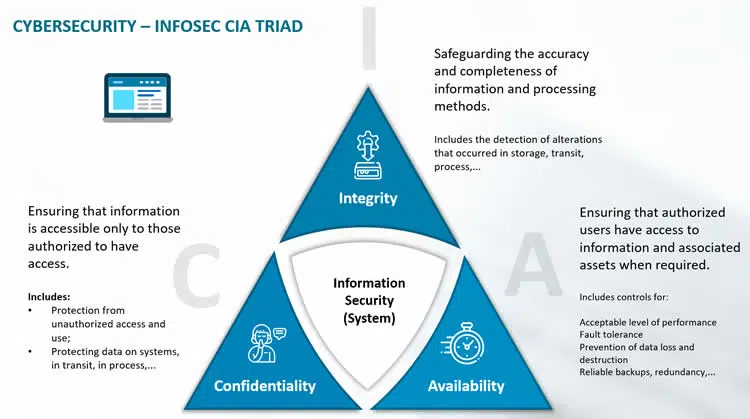
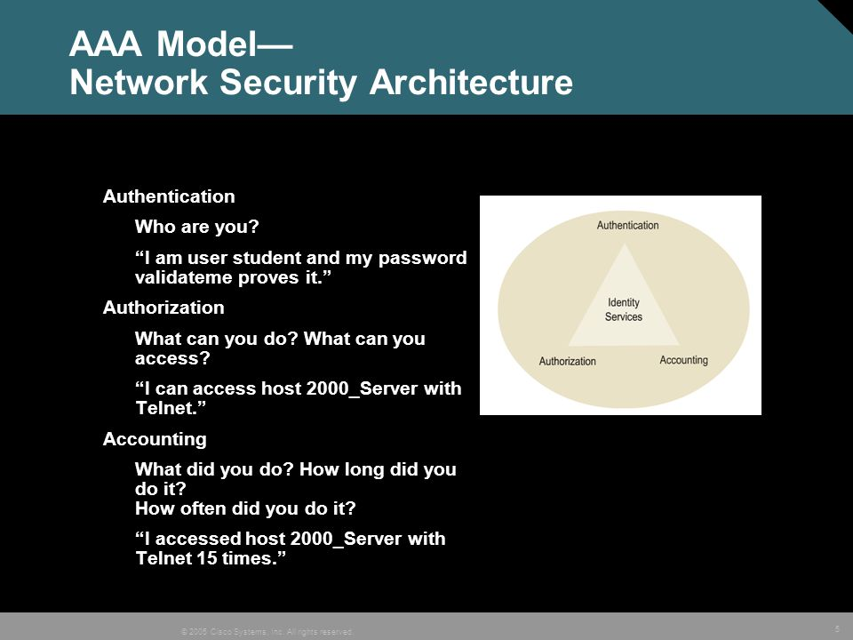
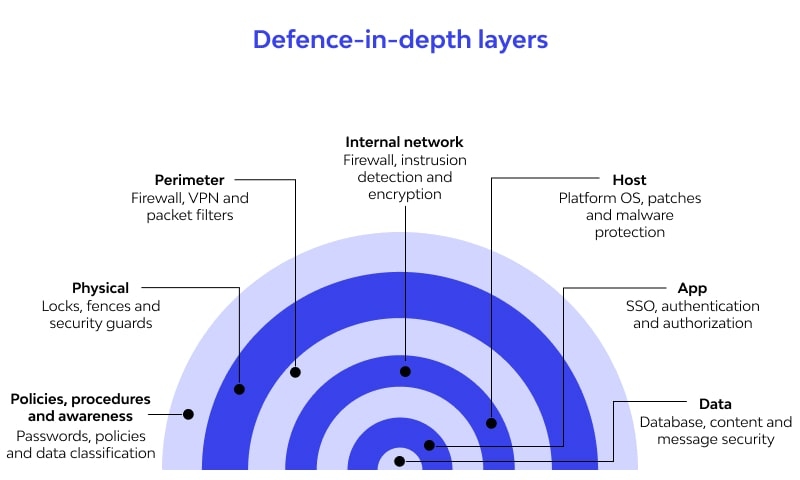

### _Some Terminologies about Cyber Security_

### **CIA Triad :**
 The three letters in "CIA triad" stand for Confidentiality, Integrity, and Availability. The CIA triad is a common model that ***forms the basis for the development of security systems.*** They are used for finding vulnerabilities and methods for creating solutions.

  . **Confidentiality:** _ensuring that information is accessible only to those authorized to have access.For example : Encryption_

  .**Integrity:** _safe guarding the accuracy and completeness of information and processing methods . example : Hashing, Digital signatures_
  
  . **Availability:** _ensuring that authorized users have access to information and associated assets when required.Example :Backups, redundant system_
 
 

 
### **AAA :**
Authentication, authorization, and accounting (AAA) is a security framework that controls access to computer resources, enforces policies, and audits usage.



### **Threat and Threat Actor**

  ***Threat :*** A cyber threat is an activity,  aimed to harm  the security of an information system by altering the availability , integrity , or confidentiality  of a system or the information it contains.

 ***Threat Actor :*** Cyber threat actors are states, groups, or individuals who, with malicious intent, aim to take advantage of vulnerabilities, low cyber security awareness, or technological developments to gain unauthorized access to information systems in order to access or otherwise affect victims’ data, devices, systems, and networks. 

 _In short Threat is an action to harm any assets and a threat actor is , who   take those action ._

### **vulnerability :** 
  A vulnerability in cyber security refers to any weakness in an information system, system processes, or internal controls of an organization that can be exploited by cyber criminals to gain unauthorized access to a computer system. 

### **Mitigation :** 
  The definition of mitigation refers to Reducing risks or effects. 

### **Defense in Depth :** 
A defense-in-depth strategy,   refers to a cybersecurity approach that uses multiple layers of security for holistic protection.
A layered defense helps security organizations reduce vulnerabilities, contain threats, and mitigate risk.




### **Basic Linux command** 
  ```
  . w  =>        currently active user info 
  . whoami =>    logged user info
  . ls =>        present directory's file list
  . man ls =>    argument list details for ls command
  . sudo su =>   root user activation
  . pwd   =>     to see present work directory
  . cd  / =>     change directory to root directory
  .nano test.py=>               create a file also open with an editor
  . chmod +x test.py=>          change mood to executable 
  . python test.py  =>          run a python file with python 2
  . python3 test.py =>          run a python file with python 3
  . w > out.txt  =>             redirect a file with write mood
  . cat out.txt  =>             display a file 
  . grep 'some text' fileName.extension =>   search some text from any file .
  . grep 'text' fileName.extension > result.txt  => search 'text' in fileName.extension also show this result in result.txt file.

  ```

### **Softwate install**
 - [7zip](https://www.7-zip.org/download.html)  ( an open-source file archiver)
 

### **Tips for VM Box**
 - open vm box then click on Tools then select preferences 
 - click on Network option 
 - if there are already selected a NatNetwork then ok otherwise add a Nat network from right side icon.
 - then click on Extensions and add Oracle VM VirtualBox Extension Pack

- `also` 
- right click on kali select settings go with Network and select 
      a. attacked to : Nat Network
      b. name:  NatNetwork
      c. click ADvanced and select Promiscuous Mode to Allow VMs then mark cable connected 
- click ok

### **Task**
 - complete [linux unhatched](https://www.netacad.com/courses/os-it/ndg-linux-unhatched) course at least 50%
 - start learning from  [linux journey](https://linuxjourney.com/lesson/the-shell)
 - start the [linux command cheat sheet](../Book/LinuxCommandLineCheatSheet.pdf)
 - write down  your own note .