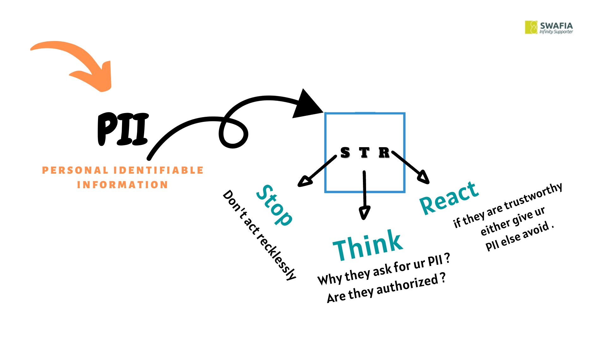

### Social Engineering Threat
- [x]   Social engineering attacks are a type of cyber crime wherein the attacker fools the target through impersonation. They might pretend to be your boss, your supplier, someone from our IT team, or your delivery company. Regardless of who they're impersonating, their motivation is always the same — extracting money or data.
- [x]   Social engineering uses psychological manipulation to trick users into making security mistakes or giving away sensitive information.
- [x]   A social engineer can manipulate staff members into giving access to their computers, routers, or Wi-Fi; the social engineer can then steal Protected Health Information (PHI), Personal Identifiable Information (PII).

***PII***  - personal identifiable  information (name,email,no , profession ,etc)

__Personal Identifying Information (PII) is any type of data that can be used to identify someone, from their name and address to their phone number, passport information, and social security numbers. This information is frequently a target for identity thieves, especially over the Internet.__

***Now a days we can see , data are more precious other than anything's , so we should concern about our PII otherwise a social engineer can easily become a threat actor to attack ourselves***

##### so when comes the term of PII equally comes  another term of STR(stop , think , react) means 
  - Stop ,  Don't act recklessly
  - Think , why they are ask for ur PII ? are they authorized ?
  - React , if they are trustworthy either give ur PII else avoid .

  

### Tips 
- copy from terminal or cmd with specific selection (alt + select then enter )


### Soft & Tool 
- [Hashcalc](https://download.cnet.com/HashCalc/3001-2250_4-10130770.html) Generate  hash format for a file to check integrity

###  Linux Command
 
```
ps -eaf | grep apache2               => search apache2 process 
..... | ....                         => pipe command worked as ,, the output of first portion is the input of second  
                               portion ex:  history | tail -5 means over the all history took only last 5 history.

service apache2 start                => start apache2 service (any service can start with their name  )
service apache2 status               => check the status of apache2 whether it's active or not
service apache2 stop                 => stop apache2

netstat -ano                         =>network monitoring [ means which network are connected with ur debian machine 
                              also it will show , which program are responsible for those network]

kill -9 -1                            =>forcefully kill all process

ifconfig                            => show ip addr [ethernet , lookback]
 ip a                               => also show ip [ip address]
 lsof -i                            => which port are listened with internet .

 whois swafiais.xyz                  => basic info about any domain
 whatweb swafiais.xyz                => which tech are used their backend 

```
 
### Networking related resource for study
- youtube ([sunny's classroom](https://www.youtube.com/user/sunnylearning/playlists)) 
- Networking fundamental [videos](../Book/Networking/videos/)
- [Networking-101 pdf](../Book/Networking/Networking%20101.pdf) see OSI model
- study in [try hak me -introductory network ](https://tryhackme.com/room/introtonetworking)