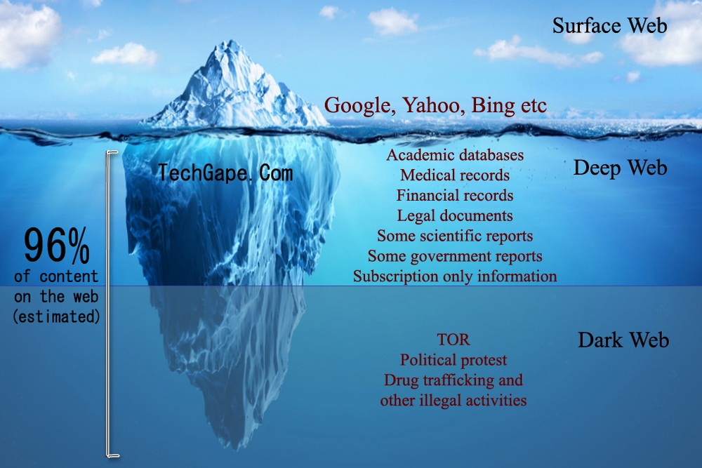

### Type of Web
There are 3 type of web , surface,deep and dark web . [Read Details ](https://www.guru99.com/deep-web-vs-dark-web.html)

__easiest way of uses deep and dark web is Brave browser cz they are provide tor connection.__





### Linux Command
```
curl domain.com       => if u don't wanna open any website by clicking then simply use curl to get header info | or any file can download by curl command [Read more](https://linuxize.com/post/curl-command-examples/)

wget url              => wget also used for download any file

gunzip fileName.gz     => unzip a .gz zip file

sed                    => serach and replace | man sed -- for see details


```

### comptia security SY0-601
- download comptia book from [zlibrary](https://b-ok.global/s/comptia%20security%20sy0-601)
- always download latest version and pick from __packt publishing__


### Phase of Hacking
There are mainly 5 phases in hacking. Not necessarily a hacker has to follow these 5 steps in a sequential manner. It’s a stepwise process and when followed yields a better result. 

1. Reconnaissance ([details](../Book/Recon-Passive_actice-Recon-OSINT.pdf))
2. Scanning
3. Gaining Access
4. Maintaining Access
5. Clearing Tracks

[self notes for Hacking phase ](../self_notes/Hacking_phase.pdf)


### Sock Puppet 

Sock puppets are nothing but detailed created fake social media accounts to research in **OSINT** without giving up the true identity.

Sock Puppets are basically aliases, fictitious persona profiles created by someone else with specific goals in mind and is part of an **OSINT** __Social Engineering__ technique.

These type of accounts can be used by anyone like investigators, detectives, hackers, police, journalists, it can be anyone who wants to impersonate someone else.

Well, it’s not as easy as it sounds, for creating a successful sock puppet it needs to be credible and consistent with how the real person behaves online. Sock puppets have a real name, real phone numbers, address, photographs, credit card number, various social media accounts, friends, etc. 
[self note about sock puppet](../self_notes/Sock_puppets.md)